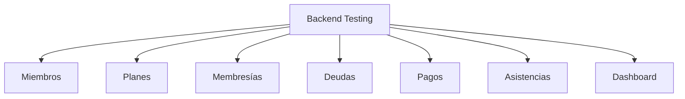

# Plan de Pruebas - Sistema de Gestión de Gimnasio

**Versión:** 1.0  
**Fecha:** 2025-12-20  
**Proyecto:** gym-mfbackend  
**Framework:** NestJS + Jest + TypeORM

---

## 1. Resumen Ejecutivo

Este documento define la estrategia de pruebas para el backend del Sistema de Gestión de Gimnasio, que incluye 7 módulos principales: Miembros, Planes, Membresías, Deudas, Pagos, Asistencias y Dashboard.

### Objetivos de Calidad

- ✅ Cobertura de código: **≥ 80%**
- ✅ Cobertura de endpoints: **100%**
- ✅ Tiempo de respuesta: **< 200ms** por endpoint
- ✅ Cero errores críticos en producción

---

## 2. Alcance de las Pruebas

### 2.1 Tipos de Pruebas

| Tipo | Herramienta | Cobertura |
|------|-------------|-----------|
| **Unitarias** | Jest | Services, Controllers, Helpers |
| **Integración** | Jest + Supertest | Endpoints REST completos |
| **E2E** | Jest + Supertest | Flujos de usuario |

### 2.2 Módulos a Probar



---

## 3. Estrategia de Testing

### 3.1 Enfoque por Capas

#### Capa de Controladores
- Validación de DTOs
- Manejo de errores HTTP
- Autenticación y autorización (futuro)
- Serialización de respuestas

#### Capa de Servicios
- Lógica de negocio
- Cálculos (deudas, fechas, etc.)
- Transacciones de base de datos
- Manejo de excepciones

#### Capa de Repositorio
- Queries complejas
- Relaciones entre entidades
- Soft deletes

---

## 4. Casos de Prueba por Módulo

### 📋 4.1 Módulo MIEMBROS

#### Endpoints a Probar

| Endpoint | Método | Casos de Prueba |
|----------|--------|-----------------|
| `/miembros` | POST | ✓ Crear con datos válidos<br>✓ Crear con membresía<br>✓ Crear con deuda parcial<br>✗ Crear con cédula duplicada<br>✗ Crear con datos inválidos |
| `/miembros` | GET | ✓ Listar todos<br>✓ Filtrar activos<br>✓ Respuesta vacía |
| `/miembros/buscar` | GET | ✓ Buscar por nombre<br>✓ Buscar por cédula<br>✓ Sin resultados |
| `/miembros/:id` | GET | ✓ Encontrar existente<br>✗ ID no encontrado |
| `/miembros/:id/completo` | GET | ✓ Con membresía activa<br>✓ Con deudas pendientes<br>✓ Sin membresía |
| `/miembros/:id` | PUT | ✓ Actualizar datos<br>✗ ID inexistente |
| `/miembros/:id` | DELETE | ✓ Soft delete<br>✗ ID inexistente |

#### Lógica de Negocio

```typescript
describe('MiembrosService - Business Logic', () => {
  it('debe generar código único GYM-0001, GYM-0002, etc.');
  it('debe crear membresía automática si planId está presente');
  it('debe crear deuda si montoPagado < precioPlan');
  it('NO debe crear deuda si montoPagado >= precioPlan');
  it('debe desactivar en lugar de eliminar (soft delete)');
  it('debe buscar por nombre, apellido, cédula o código');
});
```

---

### 💳 4.2 Módulo MEMBRESÍAS

#### Endpoints

| Endpoint | Método | Casos de Prueba |
|----------|--------|-----------------|
| `/membresias` | GET | ✓ Listar todas<br>✓ Con relaciones (miembro, plan) |
| `/membresias/activas` | GET | ✓ Solo estado 'activa' |
| `/membresias/por-vencer` | GET | ✓ Próximos 7 días<br>✓ Cálculo de días restantes |
| `/membresias/vencidas` | GET | ✓ Estado 'vencida'<br>✓ Días vencidos |

#### Lógica Crítica

```typescript
describe('MembresiasService - Cálculos de Fechas', () => {
  it('debe calcular fechaFin = fechaInicio + mesesPagados');
  it('debe identificar membresías que vencen en 7 días');
  it('debe calcular días restantes correctamente');
  it('debe encontrar membresía activa de un miembro');
});
```

---

### 💰 4.3 Módulo DEUDAS

#### Endpoints

| Endpoint | Método | Casos de Prueba |
|----------|--------|-----------------|
| `/deudas` | GET | ✓ Listar todas con relaciones |
| `/deudas/pendientes` | GET | ✓ Estados 'pendiente' y 'parcial' |
| `/deudas/miembros-con-deudas` | GET | ✓ Agrupación por miembro<br>✓ Suma de deudas |
| `/deudas/miembro/:id` | GET | ✓ Deudas de un miembro específico |

#### Lógica de Abonos

```typescript
describe('DeudasService - Abonar', () => {
  it('debe actualizar montoPagado y montoPendiente');
  it('debe cambiar estado a "parcial" si queda saldo');
  it('debe cambiar estado a "pagada" si montoPendiente <= 0');
  it('debe lanzar error si deuda no existe');
});
```

---

### 🏋️ 4.4 Módulo PLANES

#### Endpoints

| Endpoint | Método | Casos de Prueba |
|----------|--------|-----------------|
| `/planes` | GET | ✓ Listar todos los planes |
| `/planes/:id` | GET | ✓ Plan existente<br>✗ Plan inexistente |

---

### 💵 4.5 Módulo PAGOS

#### Endpoints

| Endpoint | Método | Casos de Prueba |
|----------|--------|-----------------|
| `/pagos` | GET | ✓ Listar con relaciones |
| `/pagos/resumen-mes` | GET | ✓ Cálculos agregados<br>✓ Filtro por mes actual |
| `/pagos/por-metodo` | GET | ✓ Agrupación correcta<br>✓ Suma por método |

#### Validaciones

```typescript
describe('PagosService - Resumen Mensual', () => {
  it('debe filtrar solo pagos del mes actual');
  it('debe calcular total_pagos, ingresos_totales, promedio_pago');
  it('debe retornar 0 si no hay pagos en el mes');
});
```

---

### 📊 4.6 Módulo ASISTENCIAS

#### Endpoints

| Endpoint | Método | Casos de Prueba |
|----------|--------|-----------------|
| `/asistencias/check-in/:id` | POST | ✓ Registrar entrada<br>✗ Miembro ya tiene check-in activo |
| `/asistencias/check-out/:id` | POST | ✓ Registrar salida<br>✓ Calcular duración<br>✗ Sin check-in previo |
| `/asistencias/hoy` | GET | ✓ Solo del día actual |
| `/asistencias/en-gym` | GET | ✓ Sin fechaSalida |
| `/asistencias/estadisticas-dia` | GET | ✓ Agrupación por día de semana |

#### Cálculos

```typescript
describe('AsistenciasService - Check-in/out', () => {
  it('debe crear asistencia con fechaEntrada = now');
  it('debe calcular duracionMinutos en check-out');
  it('debe retornar error si no hay check-in activo');
  it('debe calcular minutos transcurridos para activos');
});
```

---

### 📈 4.7 Módulo DASHBOARD

#### Endpoints

| Endpoint | Método | Casos de Prueba |
|----------|--------|-----------------|
| `/dashboard/resumen` | GET | ✓ 6 métricas clave<br>✓ Valores numéricos válidos |
| `/dashboard/top-miembros` | GET | ✓ Top 5 más frecuentes<br>✓ Ordenamiento DESC |
| `/dashboard/ingresos-por-plan` | GET | ✓ Agrupación por plan<br>✓ Suma correcta |

---

## 5. Matriz de Trazabilidad

| Módulo | Endpoints | Tests Unitarios | Tests E2E | Prioridad |
|--------|-----------|-----------------|-----------|-----------|
| Miembros | 7 | 15+ | 5 | 🔴 Crítico |
| Membresías | 4 | 10+ | 3 | 🔴 Crítico |
| Deudas | 4 | 8+ | 2 | 🟡 Alto |
| Planes | 2 | 3+ | 1 | 🟢 Medio |
| Pagos | 3 | 6+ | 2 | 🟡 Alto |
| Asistencias | 5 | 8+ | 3 | 🟡 Alto |
| Dashboard | 3 | 5+ | 1 | 🟢 Medio |
| **TOTAL** | **28** | **55+** | **17** | - |

---

## 6. Entorno de Pruebas

### 6.1 Configuración

```json
{
  "type": "mysql",
  "host": "localhost",
  "port": 3306,
  "username": "test_user",
  "password": "test_pass",
  "database": "gym_test",
  "synchronize": true,
  "dropSchema": true
}
```

### 6.2 Datos de Prueba (Fixtures)

```typescript
export const mockMiembro = {
  nombre: 'Juan',
  apellido: 'Pérez',
  cedula: '1234567890',
  email: 'juan@test.com',
  telefono: '0999999999',
};

export const mockPlan = {
  nombre: 'Mensual',
  precio: 50.00,
  duracionMeses: 1,
};
```

---

## 7. Comandos de Ejecución

```bash
# Ejecutar todos los tests
npm run test

# Tests con cobertura
npm run test:cov

# Tests en modo watch
npm run test:watch

# Tests E2E
npm run test:e2e

# Test específico
npm run test -- miembros.service.spec.ts
```

---

## 8. Criterios de Aceptación

### A nivel de Suite

- [ ] Todos los tests pasan sin errores
- [ ] Cobertura ≥ 80% en todas las capas
- [ ] Tiempo total de ejecución < 30 segundos
- [ ] Sin warnings de deprecación

### A nivel de Endpoint

- [ ] Casos happy path funcionan
- [ ] Validaciones de DTOs activas
- [ ] Errores retornan códigos HTTP correctos
- [ ] Respuestas cumplen con schemas definidos

---

## 9. Riesgos y Mitigación

| Riesgo | Probabilidad | Impacto | Mitigación |
|--------|--------------|---------|------------|
| Base de datos de prueba no aislada | Media | Alto | Usar `dropSchema: true` |
| Tests flaky por timestamps | Baja | Medio | Usar `jest.useFakeTimers()` |
| Dependencias circulares | Baja | Alto | Usar `forwardRef()` |
| Queries lentas | Media | Medio | Indexar campos de búsqueda |

---

## 10. Próximos Pasos

1. ✅ Crear archivos `.spec.ts` para cada módulo
2. ✅ Implementar mocks y fixtures
3. ✅ Configurar CI/CD para ejecución automática
4. ✅ Generar reportes de cobertura
5. ✅ Documentar tests complejos

---

**Elaborado por:** IA Assistant  
**Revisado por:** [Pendiente]  
**Aprobado por:** [Pendiente]
